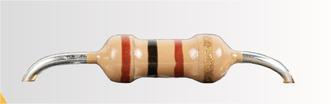
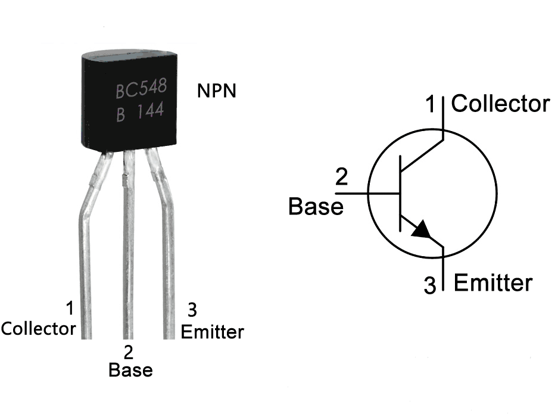

# COMPONENTS REQUIRED

## 1) Light Emitting Diode (LED)

  

A Light Emitting Diode (LED) is a semiconductor electronic device that emits light when current flows through it. LEDs are commonly used as indicator lamps in various electronic circuits and are increasingly used for lighting applications due to their energy efficiency, durability, and long operational life.
LEDs work on the principle of electroluminescence. When the diode is forward biased, electrons recombine with holes within the semiconductor material, releasing energy in the form of light. The color of the emitted light depends on the semiconductor material used in the LED.

## 2) Resistor

  

  

A resistor is a passive electronic component that is used to limit or regulate the flow of electric current in a circuit. It helps in protecting components by controlling voltage and current levels. Resistors are widely used in electronic circuits for functions such as current limiting, voltage division, and signal conditioning.
According to Ohm’s Law, the current flowing through a conductor is directly proportional to the voltage and inversely proportional to the resistance. This relationship is given by: V =I/R, Where I is the current, V is the potential difference (voltage), and R is the resistance measured in ohms (Ω).

## 3) TRANSISTOR

  

A transistor is a semiconductor device commonly uses to amplify or switch electronic signals. It is made of a solid piece of semiconductor material, with at least three terminals for connection to an external circuit.
The BC548 is an NPN transistor, meaning current flows from the collector to the emitter when a small current is applied at the base terminal. This property makes it useful for amplification and switching applications in low-power electronic circuits.

